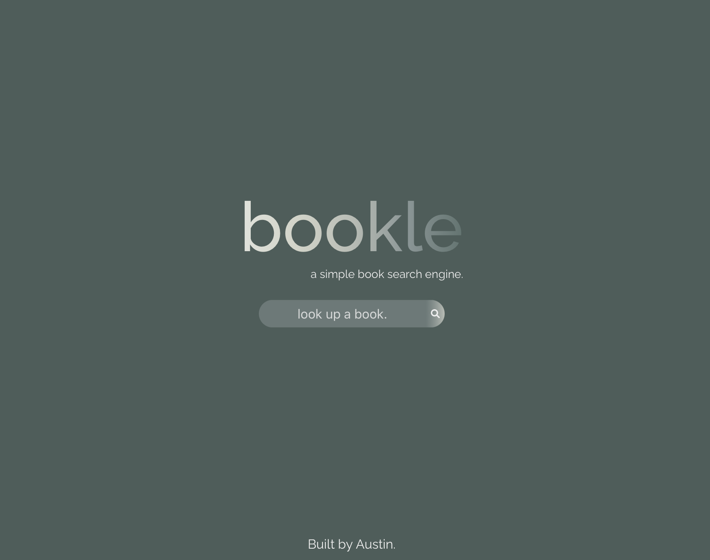
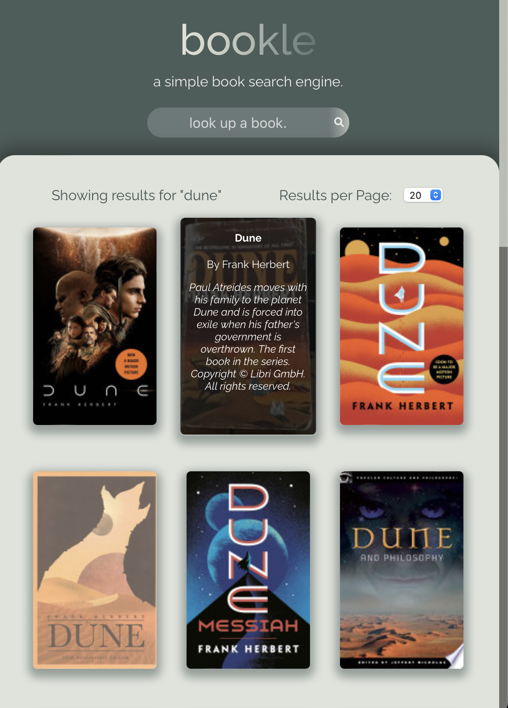
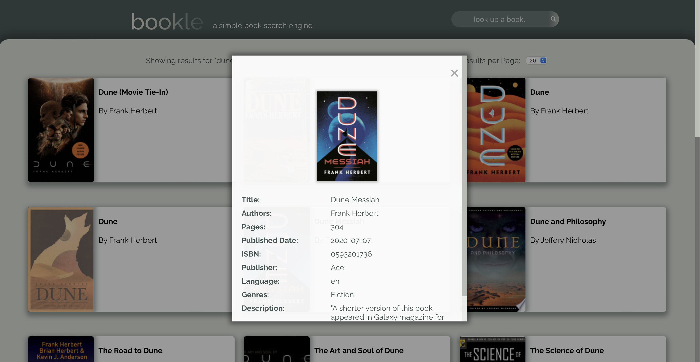

# Google Books UI

## Description

A web UI for the Google Books API using React and React Router.

### 🚀 [Launch Live Project](https://austnly.github.io/books-app/)

## Table of Contents

-   [Screenshots](#screenshots)
-   [Goals](#goals)
-   [Implementation](#implementation)
    -   [MVP](#mvp)
    -   [Plan](#plan)
    -   [Issues Addressed](#issues-addressed)
    -   [Features Added](#additions)
-   [Future Additions](#future-additions)

## Screenshots

<figure>

<figcaption><i>Home Page</i></figcaption>
</figure>

<figure>

<figcaption><i>Responsive UI</i></figcaption>
</figure>

<figure>

<figcaption><i>Search Result Modals</i></figcaption>
</figure>

## Goals

-   To learn to create and deploy modular components and containers using **React**
-   To organise components and routes effectively with **React Router**
-   To create a functional, intuitive and aesthetic interface using HTML and SCSS

## Implementation

### MVP

1. Create a page that allows users to search for books
1. Page should include the following:
    - Header section introducing the page
    - Form containing a text input and a submit / search button
    - A grid of books

Instructions:

-   When the submit button is clicked you need the request books from the Google books API using the input value as your query string
-   The books that you receive should be rendered in the books grid.
-   Each book in the grid should have an image, author, title and description
-   The grid should be responsive on different screen sizes
-   You should use async / await for your request code, NOT .then

Styling (required):

-   This application should look good, take some time to pick a palette and plan out your design. You can use tools like Figma or wireframe pro to plan what your application is going to look like.
-   Styling must use BEM, and each block should have its own SCSS file
-   Your palette should use variables

Application Design (required):

-   You should separate DOM functions and non-DOM functions in different modules Example: https://github.com/nology-tech/kiribati-resources/tree/main/js/modules
-   Write as many non-DOM functions as you can
-   Functions should do 1 thing, and should be as pure and reusable as possible
-   Always use iterators over loops
-   Always parametrize and abstract large pieces of duplicate code.

Bonus (optional, but highly recommended):

-   Give feedback to the user when no book results can be found for the query.
-   When a user clicks a book in the grid, a modal should appear with more book information, think about release, publish date, country, languages, etc.

### Plan

-   Create components (book cards, search bar, header)
-   Create containers (home, form, book list)
-   Create fetch logic
    -   Input field value acts as a state hook on button click
    -   useEffect hook to send value as fetch query to Google Books API
    -   useEffect hooks to changes in results object?
    -   Results object passed to BookGrid container
    -   Results iterated through to pass image, title, authors, description to book components
    -   Booklist re-rendered with book cards

### Issues Addressed

I encountered issues with the source API data due to missing properties, which had to be handled to prevent errors:

-   [x] Handle missing API data (authors, images etc.)
-   [x] Handling cross-component state variables

### Additions

I added the suggested bonus features, as well as some more functionality to the search:

-   [x] Feedback on no results
-   [x] Add modals for more info
-   [x] Utilised routes and URL parameters with React Router
-   [x] Added pagination and max results
-   [x] Details appear on hover over book image
-   [x] Restyle book cards to use image thumbnails responsively

### Future Additions

-   [ ] Group fetches to avoid triggering new fetch on each search param change
-   [ ] Add expandable search fields
-   [ ] Advanced search options (title, author, year)
